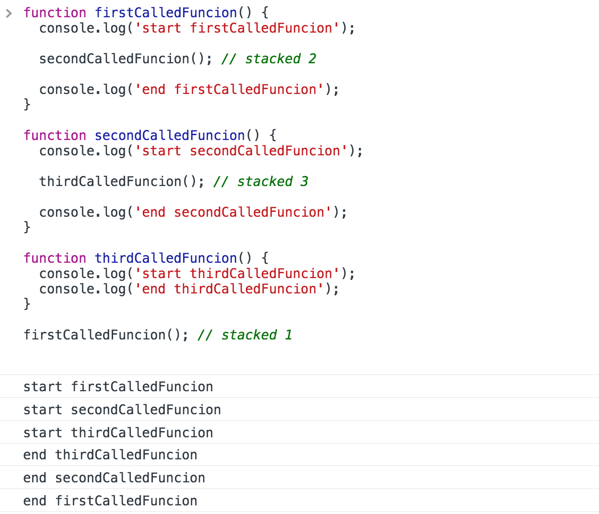
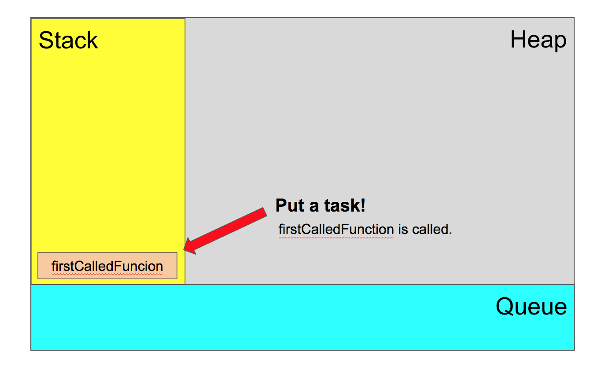
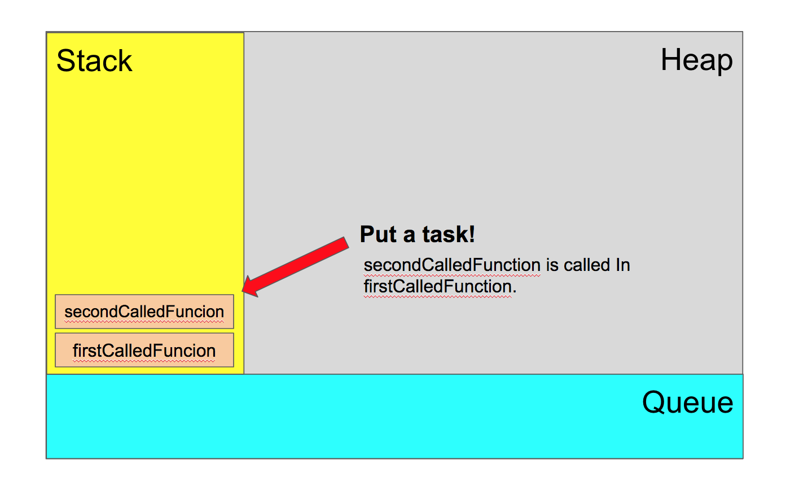
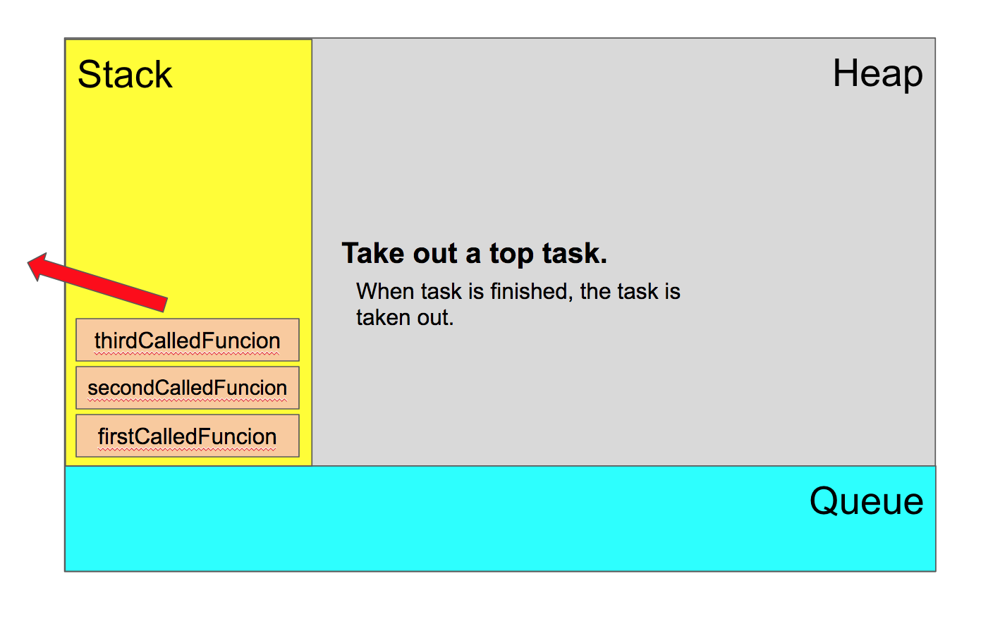
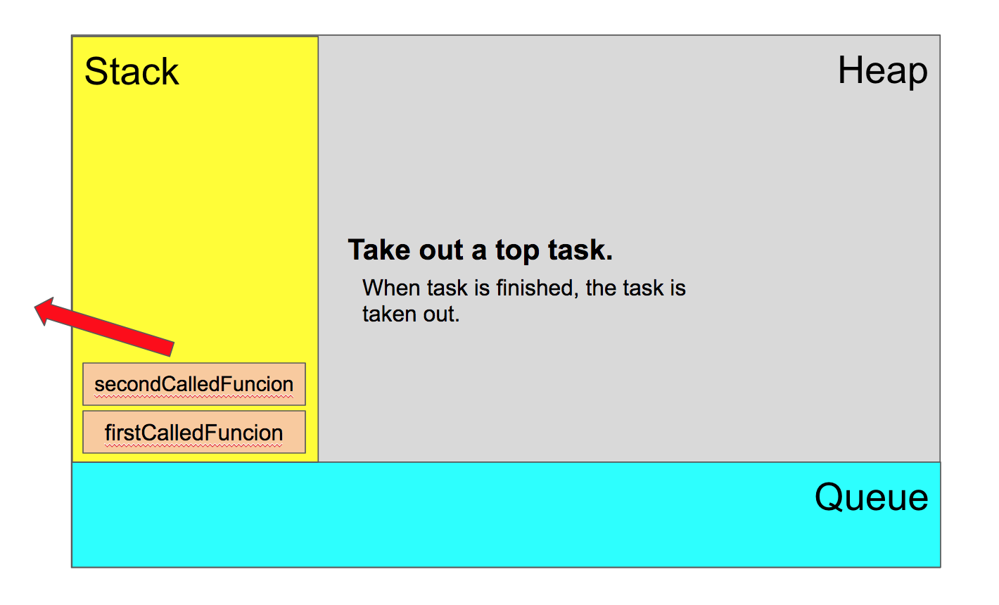
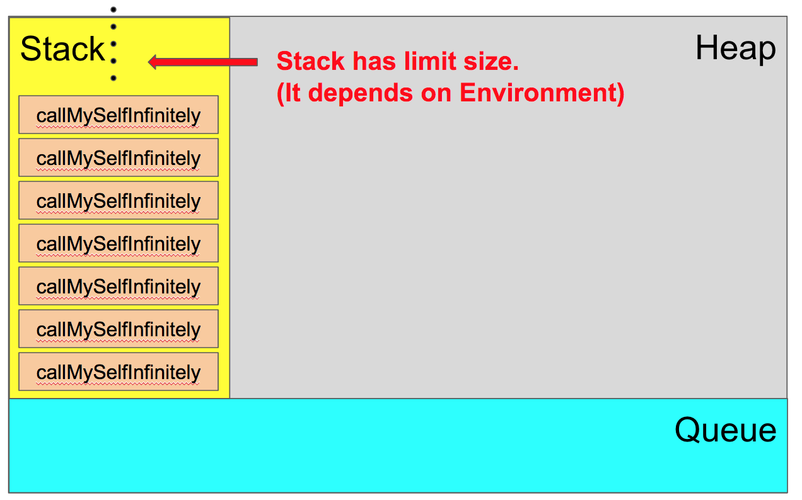
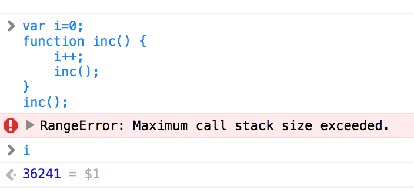
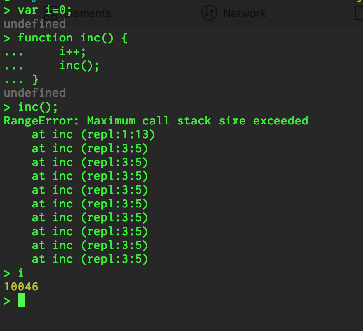

# Event loop

## Runtime Concepts

- Stack
  - Function calls form a stack of frames.
- Heap
  - Objects are allocated in a heap which is just a name to denote a large mostly unstructured region of memory.
- Queue
  - A JavaScript runtime contains a message queue, which is a list of messages to be processed. A function is associated with each message.
- Adding messages
  - In web browsers, messages are added anytime an event occurs and there is an event listener attached to it.
  - setTimeout
    - The function setTimeout is called with 2 arguments: a message to add to the queue, and a time value (optional; defaults to 0).


## Images 

### What are Heap, Stack and Queue?


### Checking How stack works

```js
function firstCalledFuncion() {
  console.log('start firstCalledFuncion');

  secondCalledFuncion(); // stacked 2

  console.log('end firstCalledFuncion');
}

function secondCalledFuncion() {
  console.log('start secondCalledFuncion');

  thirdCalledFuncion(); // stacked 3

  console.log('end secondCalledFuncion');
}

function thirdCalledFuncion() {
  console.log('start thirdCalledFuncion');
  console.log('end thirdCalledFuncion');
}

firstCalledFuncion(); // stacked 1

```



#### Flow of above example code.











### Error: Maximum Call stack size exeeded

)



### Checking limit of stack size

Limit size is depended on environment.

#### Chrome


#### Safari



#### Node.js( on my environment)



## References

- [Concurrency model and Event Loop](https://developer.mozilla.org/en-US/docs/Web/JavaScript/EventLoop) (from MDN)