# JavaScriptのプログラムの動作基礎知識 ~スタック編~

今回の記事の内容はJavaScriptの処理実行時の流れを理解することを目的としている。処理の流れを把握するために役に立つ3つの概念を3回に分けて記事にまとめる。  

今回は以下3つの概念の内「スタック」に関してまとめる。

### 3つの概念

- スタック
- ヒープ
- キュー

## この記事を読み終わったに身につく知識

- スタックが何かわかる。
- スタックの上に積まれているものから優先的に処理されることを理解する。(FILO: First In Last Out)
- スタック数にリミットがあることを理解する。


## スタックとは

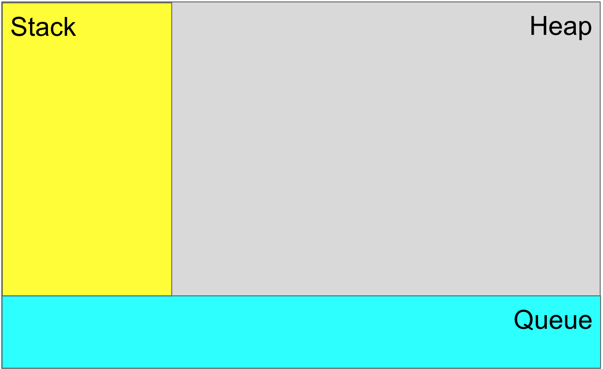

上の画像はスタック、ヒープ、キューについて図解したもので、今回はこの中のスタック(黄色い部分)の役割について説明する。

### 辞書的な意味
> a pile of things arranged one on top of another


スタックのイメージ (山積みされている本)


上記の山積みされた本を参考に、下から順番に本は積まれていって、また一番下の本が読みたくなった場合は上の本を順番に取り除くしかない。  

JavaScriptのスタックもそれと同じで、複数のタスク(関数)を実行しようとした場合は、タスクが呼ばれた順番で下から順番にタスクが積まれていって、一通りタスクが積まれたら上から順番に処理が優先的に実行されて、処理が完了したら、タスクをスタックから取り除き、次に一番上にあるタスクを実行していく。  
この処理をスタックが空になるまで繰り返していく。


## サンプルコードとイメージの流れ

```JS
function firstCalledFuncion() {
  console.log('start firstCalledFuncion');

  secondCalledFuncion(); // stacked 2

  console.log('end firstCalledFuncion');
}

function secondCalledFuncion() {
  console.log('start secondCalledFuncion');

  thirdCalledFuncion(); // stacked 3

  console.log('end secondCalledFuncion');
}

function thirdCalledFuncion() {
  console.log('start thirdCalledFuncion');
  console.log('end thirdCalledFuncion');
}

firstCalledFuncion(); // stacked 1

```


### 実際に処理を実行したときの出力


サンプルコードの簡単な説明をすると、最初に3つの関数(`firstCalledFuncion`, `secondCalledFuncion`, `thirdCalledFuncion`)を定義して、最後に `firstCalledFunction` を実行しているだけのコードである。

#### 処理1

コード終わりの方で `firstCalledFunction` 関数を呼び出してスタックにfirstCalledFunctionが積まれて、処理が実行される。

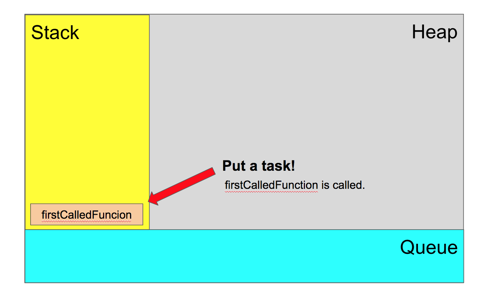

#### 処理2

`firstCalledFunction` 関数の途中で `secondCalledFuncion` 関数を呼び出して、`secondCalledFuncion` をスタックに積んでタスクの実行を行う。  
この際に、`firstCalledFunction` はまだ最後まで実行されていないため完了されていない。そのため、 `secondCalledFunction` は `firstCalledFunction` の上に積まれる。そして、`secondCalledFunction` がスタックの一番上に置かれたため、`secondCalledFunction` の処理の実行が優先されるようになる。

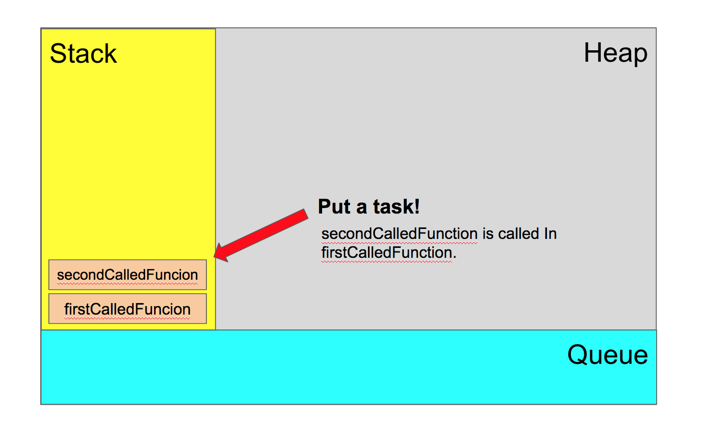

#### 処理3

`secondCalledFuncion` 関数の途中で `thirdCalledFuncion` 関数を呼び出して、`thirdCalledFuncion` をスタックに積んでタスクの実行を行う。  
この後の処理の流れは 「処理2」と同じ流れ。

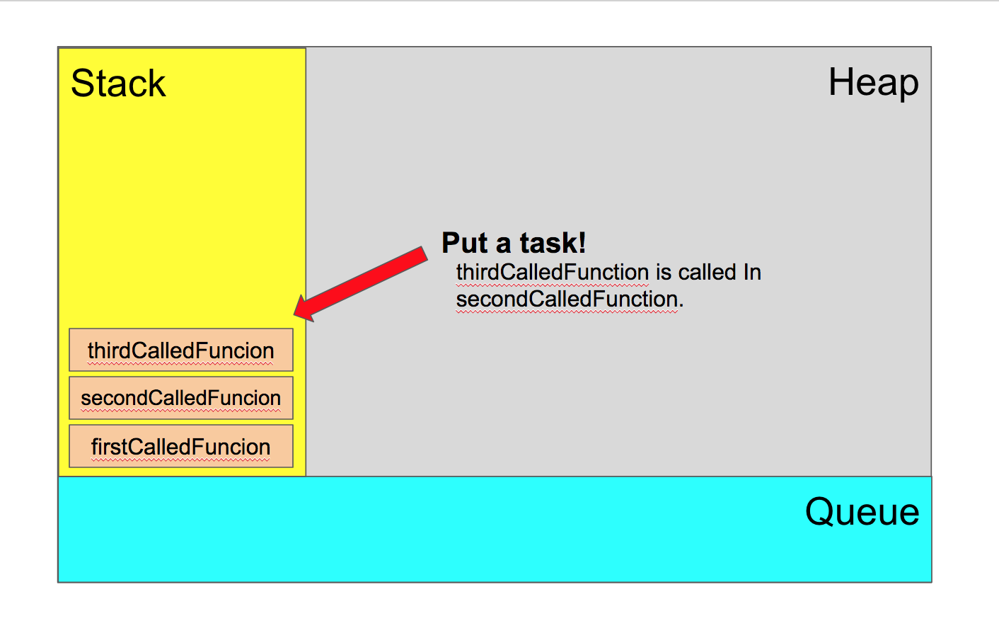

#### 処理4

`thirdCalledFuncion` 関数の中では特に外部の関数を呼び出していないため、そのまま最後まで `thirdCalledFunction` の処理が実行されて、一通りの処理が完了したらスタックから取り除かれる。

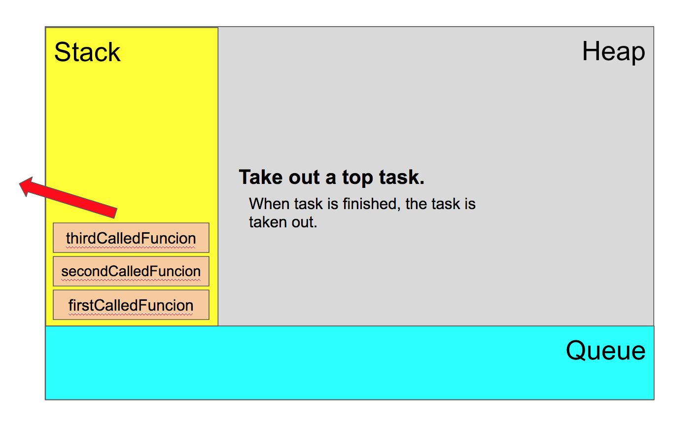

#### 処理5

スタックから `thirdCalledFuncion` が取り除かれ、、スタックの中で一番上に置かれているタスクは `secondCalledFunction` となり、 `secondCalledFunction` の処理の続きが実行される。今回のサンプルコードの場合は、処理の続きの後に新たに別のタスク(関数)を呼び出していることも無いためそのまま最後まで実行されて `secondCalledFunction` がスタックから取り除かれる。

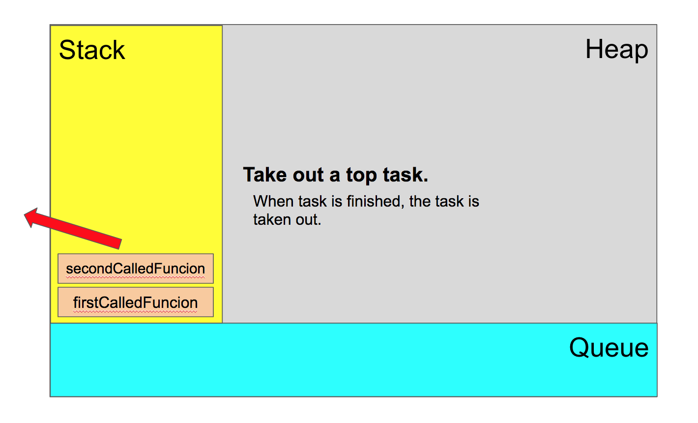

#### 処理6

スタックから `secondCalledFuncion` が取り除かれ、スタックの中で一番上に置かれているタスクは `firstCalledFunction` となる。  
以降の処理は「処理6」と同じ流れとなり、`firstCalledFunction` が スタックから取り除かれる。

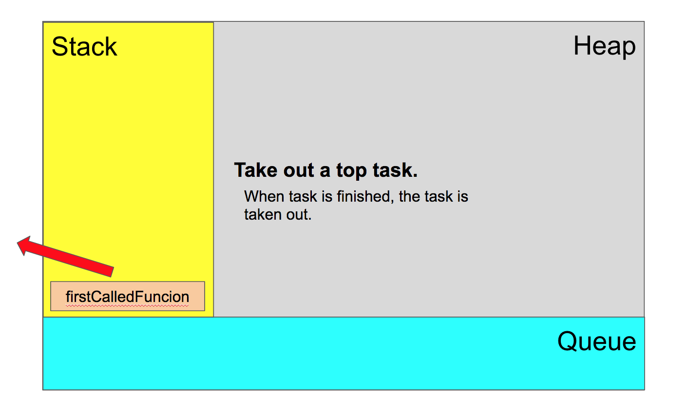

#### 処理7

全てのタスクがスタックから取り除かれ、スタックの中身は空になった。

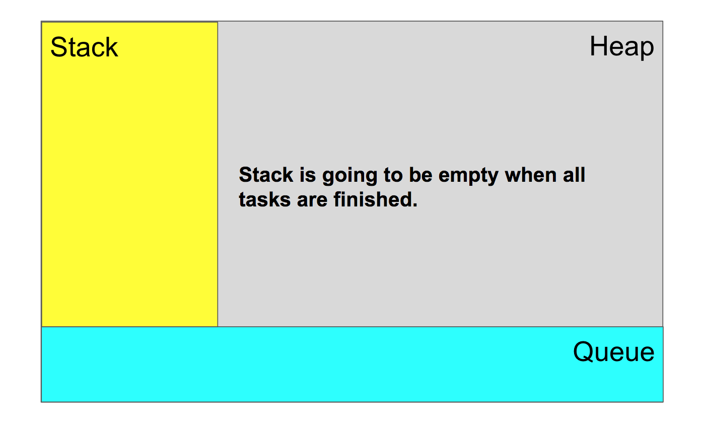


### タスクはスタックに無限に積める？

結論から言うと無限には詰めず、無限ループが発生するとエラーが発生して処理が終了する。(以下の画像は関数内で自分自身の関数を呼び出した時の結果である。)


上記の実行内容をイメージで表すと以下のようなイメージとなる。  
スタックがどんどん積まれていって、スタックが許容しているリミット値を超えるとエラーが発生する。

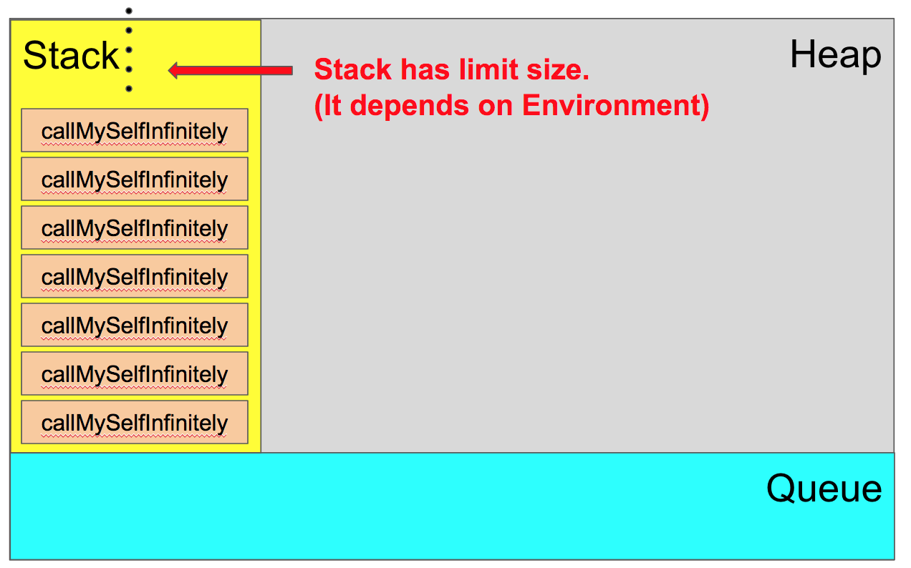


#### スタックはどれくらいのタスクを許容しているか？

こちらも結論から言うと、環境によってことなる。  
以下に３つの環境(Google Chrome, Safari, Node)でスタックの数を確認したが、基本的に無限ループさえ実行されなければこのようなエラーになることはない数値であることがわかった。

- 実行時のスタックの限界値
  - Google Chrome: 10444
  - Safari: 36241
  - Node: 10046

#### Chrome

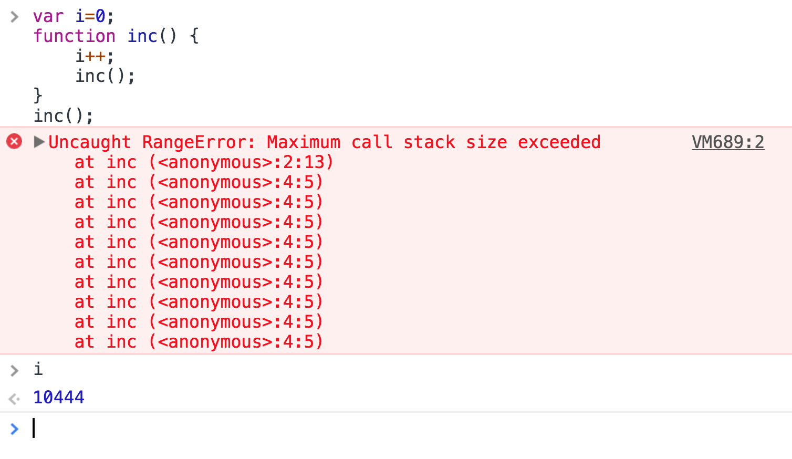

#### Safari

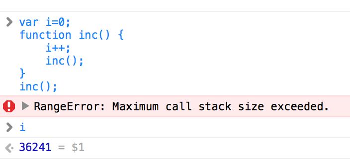

#### Node.js( on my environment)

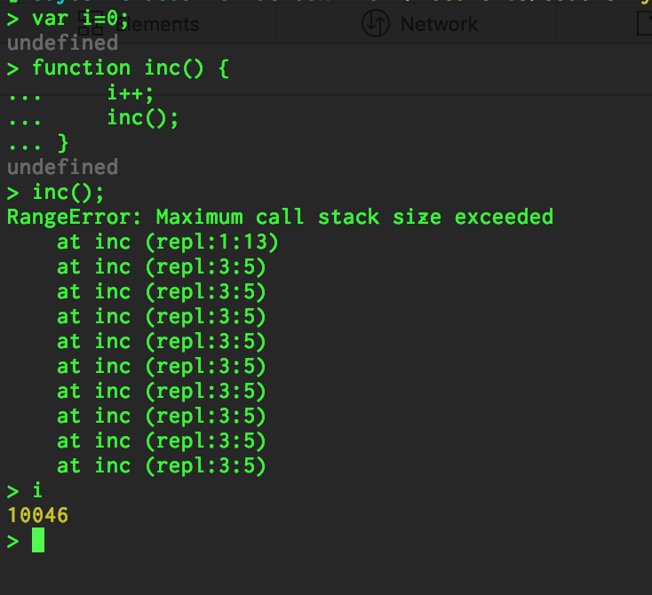

## References


## 参考にしたサイト

- [Concurrency model and Event Loop](https://developer.mozilla.org/en-US/docs/Web/JavaScript/EventLoop)
- [Cambridge Dictionary](http://dictionary.cambridge.org/dictionary/english/stack)
- [[フリー写真] 積み重ねた本](http://01.gatag.net/tag/%E6%9C%AC%EF%BC%88%E6%9B%B8%E7%89%A9%EF%BC%89/)