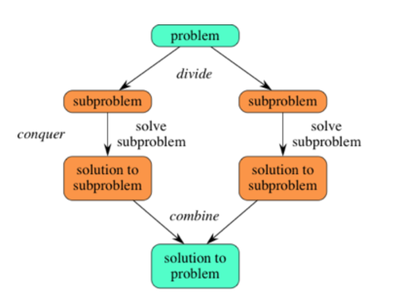
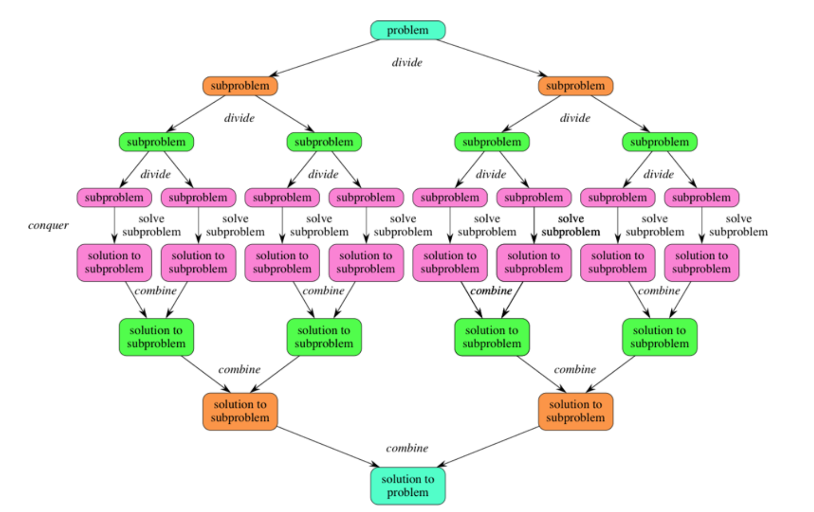
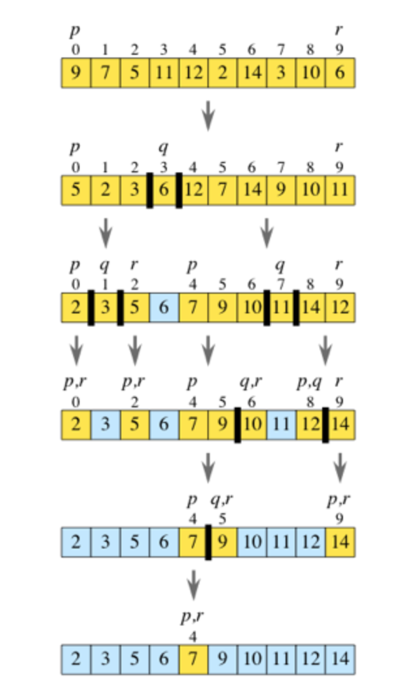
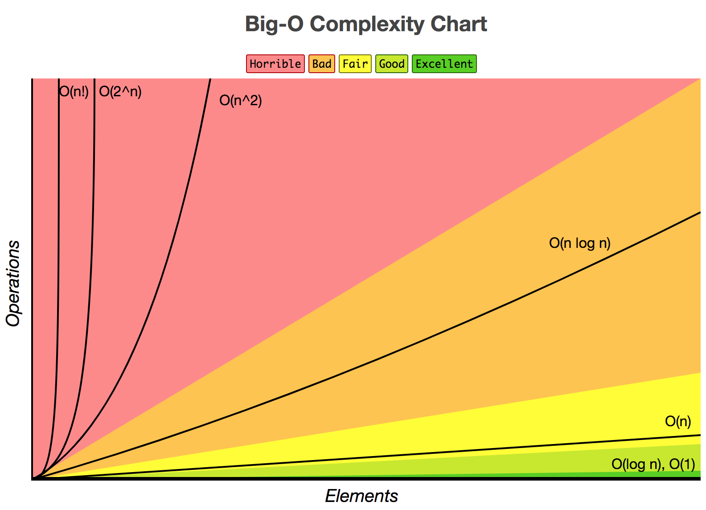
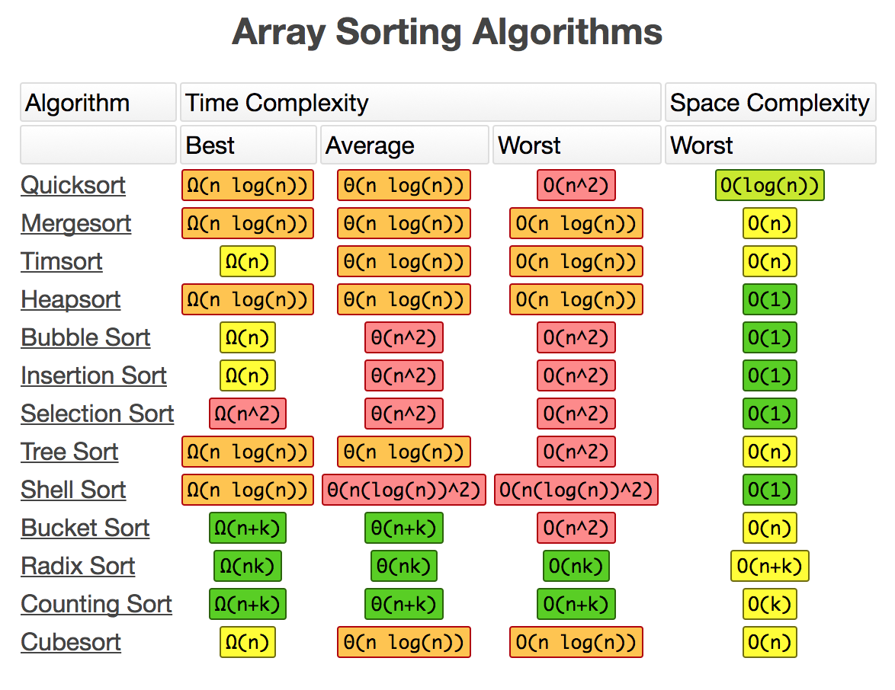

# Quick Sort

## Target User

- Advanced Beginner or Intermediate

## Why I wrote this

- To organize knowledge

## how is this important?

- Quick Sort is important when you feel your program is slow
- You can sort a lot of data in an array quickly imcomparison to other sort algorithm such as bubble sort and insertion sort.

## what are some recommended links if the user wants to read more

- see recources I wrote at the end of this article.

## Algorithms

- Divide and conquer algorithms
  - That devide one big problem into two small problems and do same things following process.
  - To combine all small problems that are devided.

## Images that describe how quick sort works.

### Divide and Conquar

### How Quick Sort works

### Time Complexities

## resources

- [Overview of quicksort](https://www.khanacademy.org/computing/computer-science/algorithms/quick-sort/a/overview-of-quicksort)
- [Divide and conquer algorithms](https://www.khanacademy.org/computing/computer-science/algorithms/merge-sort/a/divide-and-conquer-algorithms)
- [Big-O Cheat Sheet](http://bigocheatsheet.com/)
- [Quicksort algorithm (Youtube)](https://www.youtube.com/watch?v=COk73cpQbFQ)
- [Bubble sort algorithm (Youtube)](https://www.youtube.com/watch?v=Jdtq5uKz-w4)