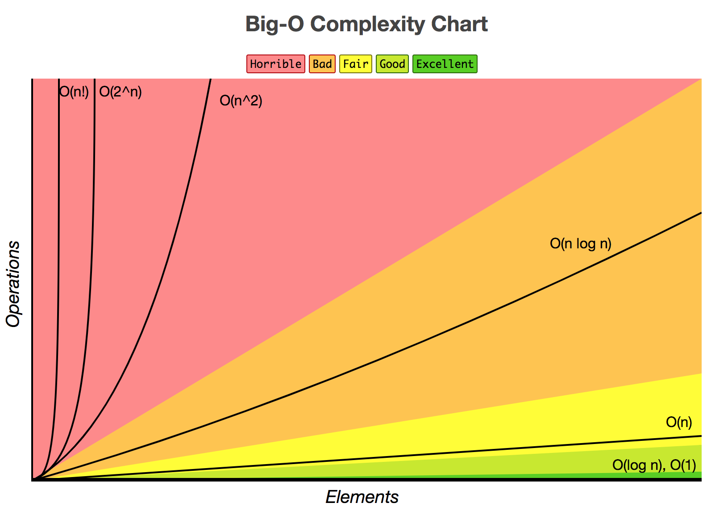
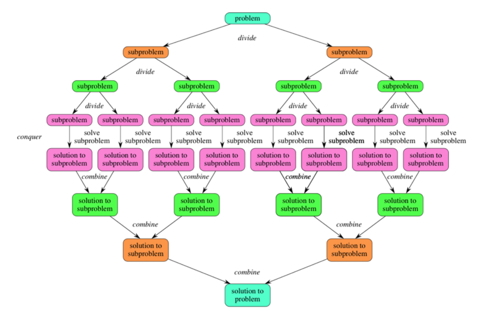

# QuickSortの概要

## 対象読者

- クイックソートの仕組みを知りたい人
- エンジニア中級者もしくは中級者手前の人
- 配列のソートで時間がかかって苦しんでいる人

---

## なぜこのブログを書いたか

今までプログラムをそこそこ書いてきたが、あまり構造を意識せずにライブラリにたくさん頼ってきて、それぞれのデータ構造やアルゴリズムがどのようにして動いているのか理解していなかったが、現在通っているコードクリサリスでその基本部分を学んでいて、実際にクイックソートのアルゴリズムを理解してスクラッチでquicksortのプログラムを書いたので、自分の頭の整理のためにこのブログを書くことにした。

---

## クイックソートの何が良いのか？

ソートアルゴリズムは色々と種類があるが、その中でもなぜクイックソートが良いのか説明する。

今回は以下のソートで比較するが、QuickSort以外の詳細についてはこのブログでは割愛する。(以下の参照サイトにBubble SortのYoutubeのリンクを貼ったので、そちらを確認してもらえたらと思う。)

- Quick Sort
- Bubble Sort


### 計算量比較 (参照サイト: [Big-O Cheat Sheet](http://bigocheatsheet.com/))




上記の内、2枚目の画像からQuick SortとBubble Sortの平均スピードを確認すると平均のTime Complexityは以下の通りである。

- Quick Sort : O(n log n)
- Bubble Sort : O(n^2)

上記のそれぞれの計算量によるパフォーマンスの差を一枚目の画像で確認すると、要素数が増えれば増えるほど一気に差が大きくなる。

そのため、大きな配列を扱う際には何も考えずにBubble Sortやその他の平均でO(n^2)の計算量が必要となってしまうソーティングアルゴリズムを使うと、プログラムのパフォーマンスに深刻な被害をもたらしてしまう可能性が高い。　　

それと比較してQuick SortやMerge Sortはパフォーマンス的にO(n^2)のソーティングアルゴリズムと比べると大分処理スピードで優位に経つため、ソートプログラムを書く際は、クイックソートのようなlog(n log n)の計算量で済むプログラムを書いた方が良い。

---

## クイックソートで使われているアルゴリズム

Quick Sortは "Divide and conquer algorithms" というアルゴリズムで実装される。

以下の2枚の画像は "Divide and conquer algorithms" について表している画像で以下の4つのプロセスを繰り返して行っている。

1. 一つの問題を分割して小さな問題にする。
2. 小さな問題を解決するために更に小さな問題に分割する。
3. 問題が最小になるまで1と2を繰り返す。
4. 解決した問題を最終的に一つにまとめる。

上記4つのプロセスがQuick Sortではどのようにして使われるか次のセクションで説明する。

### Divide and Conquar (参照サイト: [Divide and conquer algorithms](https://www.khanacademy.org/computing/computer-science/algorithms/merge-sort/a/divide-and-conquer-algorithms))




---

## クイックソートの処理の流れ(参照サイト: [Overview of quicksort](https://www.khanacademy.org/computing/computer-science/algorithms/quick-sort/a/overview-of-quicksort))

ここでは例としてランダムに数字が10個格納された配列を持っているとする。

この配列のなかから一つの数字を基準(pivot)として選び、pivot以下の数値を格納した配列(Left)と、pivotより大きい値を格納した配列(Right)の２つの配列に分ける。(Divide)

この記事では参照元のサイトと同じように配列の中で一番最後の要素を常にpivotとして選択することにする。

２つに分けた配列(LeftとRight)をさらに分裂するため、それぞれの配列の一番最後の要素の値をpivotとして、その配列内でpivot以下の値をLeftに、pivotより大きい値をRightに格納して、これ以上分割出来なくなるまで同じ処理を繰り返す。

言葉だけで説明してもイメージがつきにくいため、以下の画像を利用して各プロセスに分けて処理の内容を説明する。


### プロセス1

配列の中の一つの値をpivotとして選択してpivot以下とpivotより大きい値の２つに分裂する。

### プロセス2

今回の例では常に配列内の一番最後の要素をpivotとして扱うため、"6"がpivotとして選択されて、6以下の値が6より左に、6より大きい値が右のグループに分類される。

### プロセス3

プロセス2で左グループでは3,右グループでは11がpivotとして選択されるため、それぞれのグループ内では以下のようにグループ分けされる。

- 左グループ
  - 3以下の値は左のグループに分類される。
  - 3より大きい値は右のグループに分類される。
- 右グループ
  - 11以下の値は左のグループに分類される。
  - 11より大きい値は右のグループに分類される。

### プロセス4

プロセス3での左グループ内で分裂された"2"(左)と"5"(右)はこれ以上分類できないので左グループの処理はこれにて終了となる。

プロセス3の右グループに関しても、最終的に分類が出来なくなるまで同じ処理を続ける。


### プロセス5, 6

プロセス3での作成された右グループも最終的に最小単位まで分割されたので処理が終了となり、最終的にソートされた値のなった。


## まとめ

大きな配列を２つに分割して、さらにその分割された配列を同じ方法で２つに分割して、これ以上分割が出来なくなるまで処理を繰り返すと説明したが、これはすなわち再帰的に処理を行うことを意味している。

最後に上記で説明したプロセスをJavaScriptで実装したコードを貼ってこの記事のまとめとする。

```js
function quickSort(sourceArray) {
  if(sourceArray.length === 0) {
    return [];
  }

  // copy array to avoid modifying original array
  const copiedSourceArray = sourceArray.slice();
  // store values that are less than or equal to pivot
  let leftArray = [];
  // store values that are greater than pivot
  let rightArray = [];

  // get pivot from rightmost in an array
  const pivot = copiedSourceArray.pop();

  copiedSourceArray.forEach((value) => {
    if(value <= pivot) {
      leftArray.push(value);
    } else {
      rightArray.push(value);
    }
  });

  // continue dividing arrays until the end
  if(leftArray.length > 0) {
    leftArray = this.quickSort(leftArray, recuirsiveCount);
  }
  if(rightArray.length > 0) {
    rightArray = this.quickSort(rightArray, recuirsiveCount);
  }

  return leftArray.concat(pivot, rightArray);
}
```

## resources

- [Overview of quicksort](https://www.khanacademy.org/computing/computer-science/algorithms/quick-sort/a/overview-of-quicksort)
- [Divide and conquer algorithms](https://www.khanacademy.org/computing/computer-science/algorithms/merge-sort/a/divide-and-conquer-algorithms)
- [Big-O Cheat Sheet](http://bigocheatsheet.com/)
- [Quicksort algorithm (Youtube)](https://www.youtube.com/watch?v=COk73cpQbFQ)
- [Bubble sort algorithm (Youtube)](https://www.youtube.com/watch?v=Jdtq5uKz-w4)