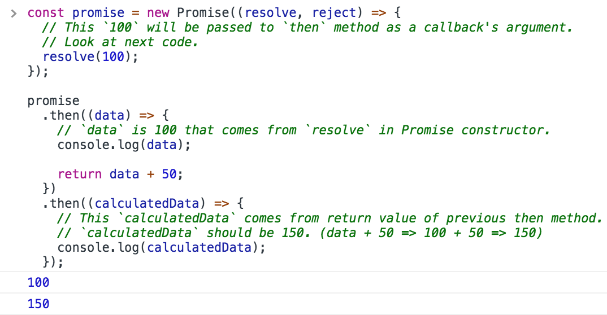
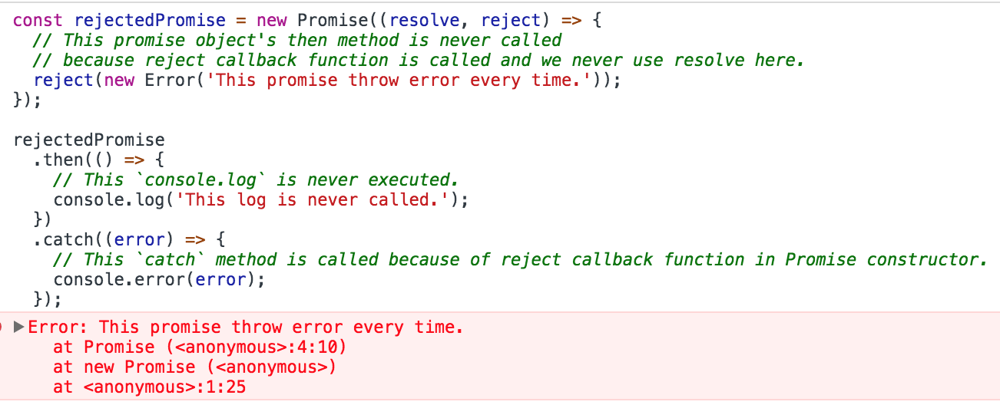
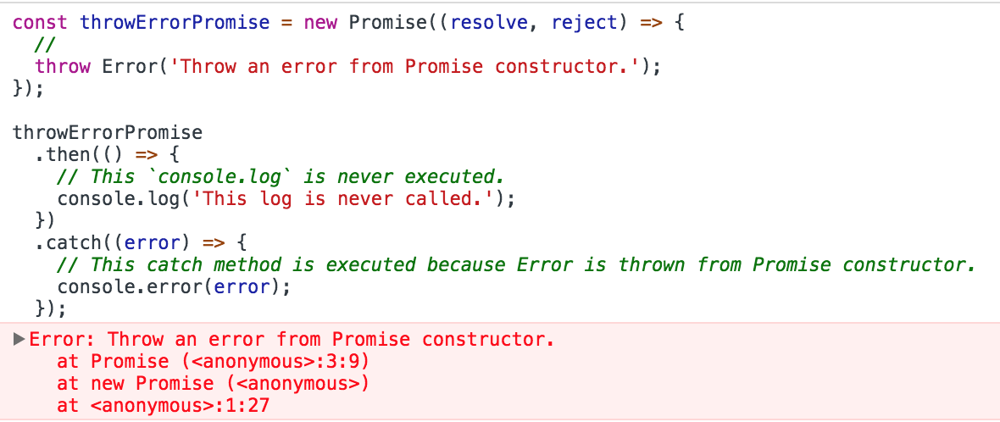
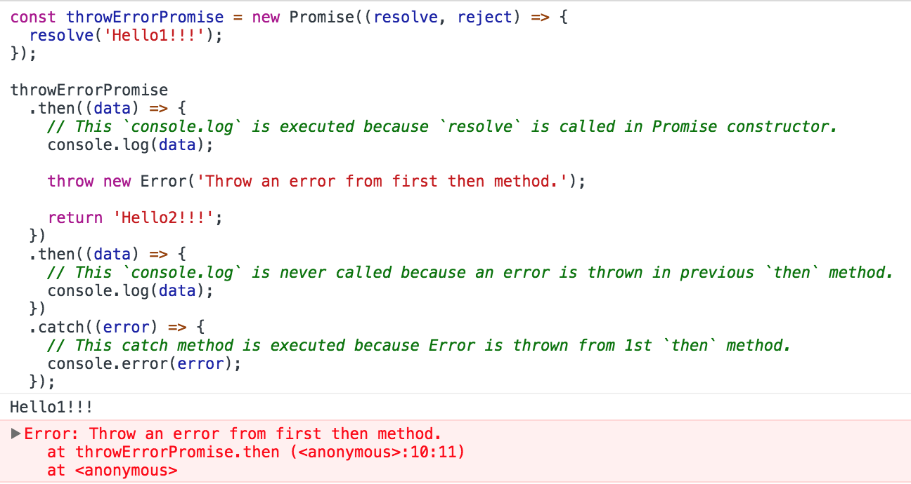
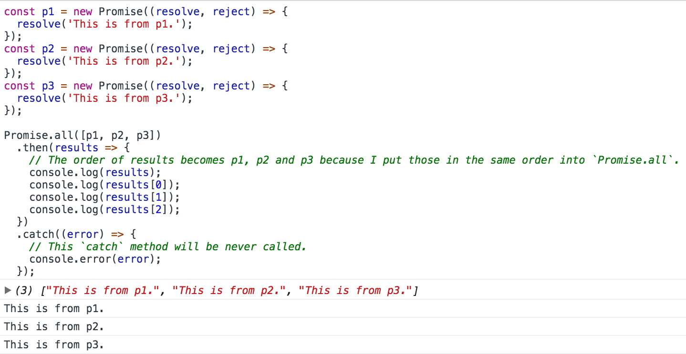
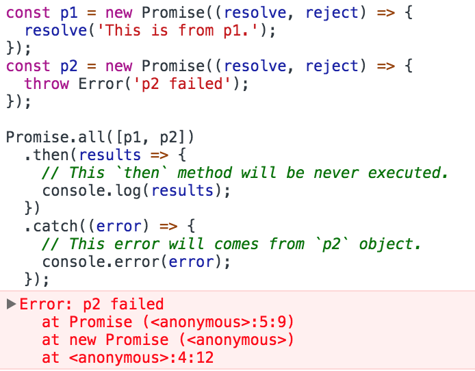

# "Promises" of JavaScript ~only 4 things what you should remember at least~

## Targets of this article

- People who know fundamental of JavaScript.
- People who understand what a callback function(higher-order function) is and can use it.
- People who want to avoid Callback Hell.

## The reason why you should use Promises.

When we need to write asyncronous functions, our code tend to be nested code. For example, let's see the below example code.


```js
const fs = require('fs');

// ### Callback Hell Pattern ###
function getComindedReviews(callback) {
  getDataWithCallback('/path/to/reviews.json', (err, reviews) => {
    if(err) throw err;
    getDataWithCallback('/path/to/products.json', (err, products) => {
      if(err) throw err;
      getDataWithCallback('/path/to/users.json', (err, users) => {
        if(err) throw err;
        const combindedReviews = buildReviews(
          reviews,
          products,
          users
        );
        callback(combindedReviews);
      });
    });
  });
}

// ### Promise Pattern ###
function getComindedReviews() {
  return Promise.all([
    getDataWithPromise('/path/to/reviews.json'),
    getDataWithPromise('/path/to/products.json'),
    getDataWithPromise('/path/to/users.json'),
  ])
  .then((results) => {
    const reviews  = results[0];
    const products = results[1];
    const users    = results[2];

    const combindedReviews = buildReviews(
      reviews,
      products,
      users
    );

    return combindedReviews;
  });
}

function getDataWithCallback(path, callback) {
  fs.readFile(path, 'utf-8', (err, data) => {
    if(err) {
      callback(err, null);
      return;
    }
    callback(null, data);
  });
}

function getDataWithPromise(path) {
  return new Promise((resolve, reject) => {
    fs.readFile(path, 'utf-8', (err, data) => {
      if(err) {
        reject(err);
      }
      resolve(data);
    })
  });
}

function buildReviews(reviews, products, users) {
  return reviews.map((review) => {
    const product = products.filter(product => {
      return product.id === review.productId;
    });
    const user = users.filter(user => {
      return user.id === review.userId;
    });

    return {
      productName: product.name,
      userName: user.name,
      comment: review.comment,
      rating: review.rating
    };
  });
}

```

This example shows 2 patterns with asyncronous functions.

- First one is using nested callback. (### Callback Hell Pattern ###)
- The other is using promises. (### Promise Pattern ###).

In this example, we read 3 files. You see that Callback pattern looks ugly and is hard to read. Imagine when we need read more files. The code is should be disaster. (nested and nested and nested and ...)

On the other hand, look at Promise pattern. Even if we read 100 files, nested level is still one. It is very easy to read and people can easily understand what this code does.

This is the biggest reason why we should use promises instead of callback-hell pattern. Code with promises when we use async functions is maintainable.


## Main 4 things of Promises that help you.

If you remember these 4 things, you will be released from callback hell.

- [Promise constructor](#promise-constructor)
- [Promise.prototype.then](#promise.prototype.then)
- [Promise.prototype.catch](#promise.prototype.catch)
- [Promise.all](#promise.all)


### **Promise constructor**

#### Syntax

```js
const promiseObject = new Promise((resolve, reject) => {});
```

- Promise constructor takes one callback function as an argument.
- the callback function has two arguments named `"resolve"` and `"reject"`. Both `"resolve"` and `"reject"` are callback functions.
  - **resolve**
    - To call `"resolve"` callback with data you want to pass when process finish successfully.
      - The data that `"resolve"` takes is passed to `"then"`. I will explain it later in [Promise.prototype.then](#promise.prototype.then) section.
  - **reject**
    - To call reject callback with error data when process fails.
      - The error data that `"reject"` takes is passed to `"catch"`. I will explain it later in [Promise.prototype.catch](#promise.prototype.catch) section.

#### Example code of Promise constructor
```js
const promise = new Promise((resolve, reject) => {
  const data = getSomethingData();

  if(data) {
    // If `data` variable has proper data => success
    resolve(data);
  } else {
    // If not, which means process failed.
    reject(new Error('process failed'));
  }
});
```

### **Promise.prototype.then**

#### Syntax

```js
const promiseObject = new Promise((resolve, reject) => {
  resolve(data);
});

promiseObject.then((data) => {});
```

- Promise object has `"then"` method which takes an argument of callback function.
- The callback function receives an argument that is passed from `"resolve"` function I explained in previous section or `"return"` statement previous then method. (I will write example code about previous `"then"` method.)
- `"then"` method returns a new promise object, which means we can use `"then"` method after other promise's `"then"` method. We call it `"method chaining"`.

#### Example code of Promise constructor

```js
const promise = new Promise((resolve, reject) => {
  // This `100` will be passed to `then` method as a callback's argument.
  // Look at next code.
  resolve(100);
});

promise
  .then((data) => {
    // `data` is 100 that comes from `resolve` in Promise constructor.
    console.log(data);

    return data + 50;
  })
  .then((calculatedData) => {
    // This `calculatedData` comes from return value of previous then method.
    // `calculatedData` should be 150. (data + 50 => 100 + 50 => 150)
    console.log(calculatedData);
  });

```




### **Promise.prototype.catch**

#### Syntax

```js
const promiseObject = new Promise((resolve, reject) => {
  reject(error);
});

promiseObject
  .then((data) => {})
  .catch((error) => {});
```

- Promise object has `"catch"` method which takes a callback function that takes an argument that is usually an error object.
- A `"catch"` method is executed when `"reject"` callback function in Promise constructor is called or Error is thrown.

#### Example code of Promise constructor

##### Pattern 1 (When `"reject"` is called.)

```js
const rejectedPromise = new Promise((resolve, reject) => {
  // This promise object's then method is never called
  // because reject callback function is called and we never use resolve here.
  reject(new Error('This promise throw error every time.'));
});

rejectedPromise
  .then(() => {
    // This `console.log` is never executed.
    console.log('This log is never called.');
  })
  .catch((error) => {
    // This `catch` method is called because of reject callback function in Promise constructor.
    console.error(error);
  });
```



##### Pattern 2 (When error is thrown from Promise Constructor.)

```js
const throwErrorPromise = new Promise((resolve, reject) => {
  throw Error('Throw an error from Promise constructor.');
});

throwErrorPromise
  .then(() => {
    // This `console.log` is never executed.
    console.log('This log is never called.');
  })
  .catch((error) => {
    // This catch method is executed because Error is thrown from Promise constructor.
    console.error(error);
  });
```



##### Pattern 3 (When error is thrown from `"then"` method.)

```js
const throwErrorPromise = new Promise((resolve, reject) => {
  resolve('Hello1!!!');
});

throwErrorPromise
  .then((data) => {
    // This `console.log` is executed because `resolve` is called in Promise constructor.
    console.log(data);

    throw new Error('Throw an error from first then method.');

    return 'Hello2!!!';
  })
  .then((data) => {
    // This `console.log` is never called because an error is thrown in previous `then` method.
    console.log(data);
  })
  .catch((error) => {
    // This catch method is executed because Error is thrown from 1st `then` method.
    console.error(error);
  });
```




### **Promise.all**

#### Syntax

```js
const p1 = new Promise((resolve, reject) => {
  resolve(data);
});
const p2 = new Promise((resolve, reject) => {
  resolve(data);
});
const p3 = new Promise((resolve, reject) => {
  resolve(data);
});
const promiseObjects = [p1, p2, p3];

Promise.all(promiseObjects)
  .then((dataList) => {})
  .catch((error) => {});
```

- `"Promise.all"` takes an array of promises.
- `"then"` method receives an array that has each result of promise objects , in this case p1, p2 and p3, in same order that we put promiseObjects(p1, p2, p3) into array as an argument of Promise.all.
- If `"promiseObjects"` that `"Promise.all"` takes has at least one error, `"catch"` method is executed insted of `"then"` method.


#### Example code of Promise constructor

##### Pattern 1 (When all promise objects succeeded.)

```js
const p1 = new Promise((resolve, reject) => {
  resolve('This is from p1.');
});
const p2 = new Promise((resolve, reject) => {
  resolve('This is from p2.');
});
const p3 = new Promise((resolve, reject) => {
  resolve('This is from p3.');
});

Promise.all([p1, p2, p3])
  .then(results => {
    // The order of results becomes p1, p2 and p3 because I put those in the same order into `Promise.all`.
    console.log(results);
    console.log(results[0]);
    console.log(results[1]);
    console.log(results[2]);
  })
  .catch((error) => {
    // This `catch` method will be never called.
    console.error(error);
  });

```




##### Pattern 2 (When at least one promise object failed.)

```js
const p1 = new Promise((resolve, reject) => {
  resolve('This is from p1.');
});
const p2 = new Promise((resolve, reject) => {
  throw Error('p2 failed');
});

Promise.all([p1, p2])
  .then(results => {
    // This `then` method will be never executed.
    console.log(results);
  })
  .catch((error) => {
    // This error will comes from `p2` object.
    console.error(error);
  });
```




## Conclusion

- Callback hell makes us suffering understanding what the code does.
- Promises enable us to organize code neater and better.
- What you should remember about Promises are only 4 things.
  - [Promise constructor](#promise-constructor)
  - [Promise.prototype.then](#promise.prototype.then)
  - [Promise.prototype.catch](#promise.prototype.catch)
  - [Promise.all](#promise.all)


## resources

- [Promise](https://developer.mozilla.org/en-US/docs/Web/JavaScript/Reference/Global_Objects/Promise)
- [Promises - Part 8 of Functional Programming in JavaScript](https://www.youtube.com/watch?v=2d7s3spWAzo)