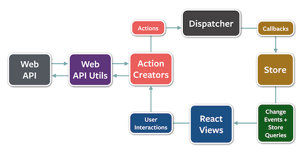

# Data flow of React and AngularJS

## Targets of this article

- People who
  - want to know what SPA is.
  - want to know characteristics of both of those.

## My experiences of those.

First of all, I have been learning React recenly and I just know AngularJS a little but I do not have much expecrience of AngularJS. If there is something wrong, I would appriciate it if correcting me.

## What is SPA?

`SPA` stands for "Single Page Application". It means that literally a server provides only an HTML file and manipulates HTML elements using JavaScript.

React and AngularJS are powerful tool of SPA. If you do not use those kinds of libraries, you would be struggle with handling elements and data.

## Data flow

As I learned, React applications mainly uses one way data flow. For example, above images describes following steps.

**example**

1. Action: Click a button.
2. Dispatcher: Event listener(callback function).
3. Store: Update something and store some values.
4. View: Update view (re-render.)
5. Action: same as *1*.

One way data flow is easy to understand how it works. React offers us a that kind of one way data flow library called `Redux`. Redux flow is similar to previous one. Look at the below image.

From React Views, steps are following.

**example**

1. Show React elements on a web page.
2. User interactions such as clicking a button.
3. By clicking a button, something action is called. In this case calling API.
4. Web API/API Utils parts. After receiving response from API server, action calls disptch.
5. If there is data from server, `Actions` pass data to `Store` via callbacks that is executed by dispather.
6. Storing data and update React Views using stored new data.

Thanks to this flow, we just follow steps one by one.

## Can we use redux on AngularJS?

My I answer about this question is `Maybe yes`. In my understanding `Redux`, that is just concepts of data flow, which means that is not for only react. Redux can be used any application even though the applications do not use react.

But, why is my answer `Maybe yes`? Actually I tried AngularJS before like 2 or 3 yeas ago. At that time, AngularJS mainly use 2 way data binding in my comprehension of AngularJS.

Two way binding is other type of data flow in addition to one way data flow.

Above picture shows two-way data binding. Two-way data binding is that Each element has/connect a model and update each other interactively. For example, imagine a `form` element. when form is populated some data, model also updates. On the other hand, when model is updated by something event or other elements, a element connected to the model also updates.

## My opinion about React and AngularJS

I prefer one way data flow because of intuitive for me, which means the reason why I stop playing around AngularJS  soon when I touched that.

Alothogh I have not written so much about Syntax of react and AngularJS, The syntax of AngularJS is also difficult to be familiar with it. AngularJS uses `ng` attiribes in HTML files. That is also one of points I do not want to use AngularJS. Comparing to AngularJS, React also has JSX that looks HTML like style and it is easy to read for me.

## Conclusion

- React and AngularJS are both powerful libraries of SPA.
- There are two styles of data flow.
  - One-way data flow
  - Two-way data binding.
- Both have unique syntax
  - AngularJS: ng attributes that uses in HTML files.
  - JSX: HTML like style and written in JSX file.

## Resources

- [Google Trends](https://trends.google.com/trends/explore?q=%2Fm%2F012l1vxv,%2Fm%2F0j45p7w)
- Github
  - [facebook/react](https://github.com/facebook/react)
  - [angular/angular.js](https://github.com/angular/angular.js)
- [React](https://reactjs.org/)
- [AngularJS](https://angularjs.org/)
