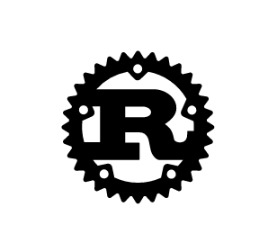

# Rust comparing to JavaScript



## Before starting topic

I have just started to learn [Rust](https://www.rust-lang.org/en-US/) and I hit the wall many times. Actually this blog is witten as a memo for me to remember and keep track of waht I learned so far.

First edition of this blog is might be lack of information for you. But I will append what I understand enough about Rust.

## Targets of this article

- People who
  - are also confused to Rust like me.
  - don't know Rust and have interest in that.
  - know syntax of JavaScript but don't know that of Rust.

## My experiences of Rust so far.

Recently I got a oppotunity to learn new programming language that I never use. I spent about 30 minutes to decide one language from Go, Clojure, and Rust. The reason why I chose Rust was Just feeling.

After deciding Rust, I began to read documentation of Rust and search good example code/projects. I had only one week create a project with Rust and also shold make presentation with lecture. So I decided to create a API server for Todo application. I am now on project and using below tools.

- [Rocket]([https://rocket.rs/]) : Web framework for Rust.
- [Diesel](http://diesel.rs/) : ORM for Rust.
- [serde](https://github.com/serde-rs/serde) : Serialization framework for Rust. Mainly using this for  Handling JSON.

This blog is not for explaing how to create Todo application with Rust. From next section, I will write down Rust and JavaScript syntax as a comparison.

## Syntax

### Variable

When we create variable in Rust, `let` keyword is used. JavaScript also has same keyword `let`. But this `let` keyword has different behavior. In JavaScript, `let` keyword allow developer to overwrite the variable. But in Rust, That is not allowed except for using `mut` keyword before variable name.


#### Example

```javascript
// JavaScript

let name = 'Alice'; // (Mutable)
name = 'Bob'; // OK
```

```rust
// Rust

let name = "Alice"; // (Immutable)
// name = "Bob" // Error

let mut name_2 = "Ace"; // (Mutable)
name_2 = "Brian"; // OK
```

If you are familiar with JavaScript, You might know `const` keyword
. `let` in Rust without `mut` keyword is similar to `const` of JavaScript.


### Function

In Rust, `fn` is a keyword when creating a function instead of `function`. Rust is a typed language so that you can put return type after `->` keyword.
JavaScript does not have this feature.

Using this functionality, Rust reduce potential bugs like other typed languages because compiler tells us invalid error if you return something value that is different from a type you set as a return type.


#### Example

```javascript
// JavaScript

function return_one() {
  return 1;
}
```

```rust
// Rust

// i32 is a data type that describe integer of 32bit.
// Value without semicolon on last line means return value.
// If you put semicolon like next example, compile error happens.
fn return_one() -> i32 {
  1
}

// If you put semicolon after value on last line
fn return_one() -> i32 {
  1;
}

// () after `->` describe void.(return nothing.)
// So compile error happens in this code because types are does not match. (void and integer are different.)
fn return_one() -> () {
  1
}
```


### struct, impl (== class of JavaScript)

You can write object in Rust with `struct` keyword and also you can add method to the `struct` value using `impl` keyword.  But methods has `&self` as first argument like [`Perl`](https://www.perl.org/). If you are not familiar with this kind of rule, Maybe it is hard to imagine. Let's see the code how that code looks likes.

```javascript
// JavaScript

class Person {
  constructor(name) {
    this.name = name;
  }

  greet() {
    console.log(`My name is ${this.name}`);
  }
}

const person = new Person('Bob');
person.greet();
```

```rust
// Rust

#[derive(Debug)]
struct Person {
  name: String
}

impl Person {
    pub fn new(name: String) -> Person {
      Person {name: name}
    }
    pub fn greet(&self) -> () {
      println!("My name is {}", &self.name);
    }
}

let person = Person::new("Bob".to_string());
person.greet();
```

In this rust code, There are few keywords `Derive` and "`&`" that I have not explained.  If you are familiar with C language, this `&` describe reference same as pointer.

But this blog is just for kind of my memo. So I don't explain those for now. If you want to know more about Derive and "`&`" below links might help you.

- [Derive](https://rustbyexample.com/trait/derive.html)
- [`&` keyword](https://doc.rust-lang.org/std/string/struct.String.html)


## Conclusion

- Rust is typed language.
- Rust has many tricky way and magic words for me.
- I try to update this blog appending what I understand enough about Rust.


## Resources

- [Rust](https://www.rust-lang.org/en-US/)
- [Todo-Backend
a shared example to showcase backend tech stacks](https://www.todobackend.com/)
- [Todo code I refered to](https://gitlab.com/duelinmarkers/todo-backend-rocket-rust)